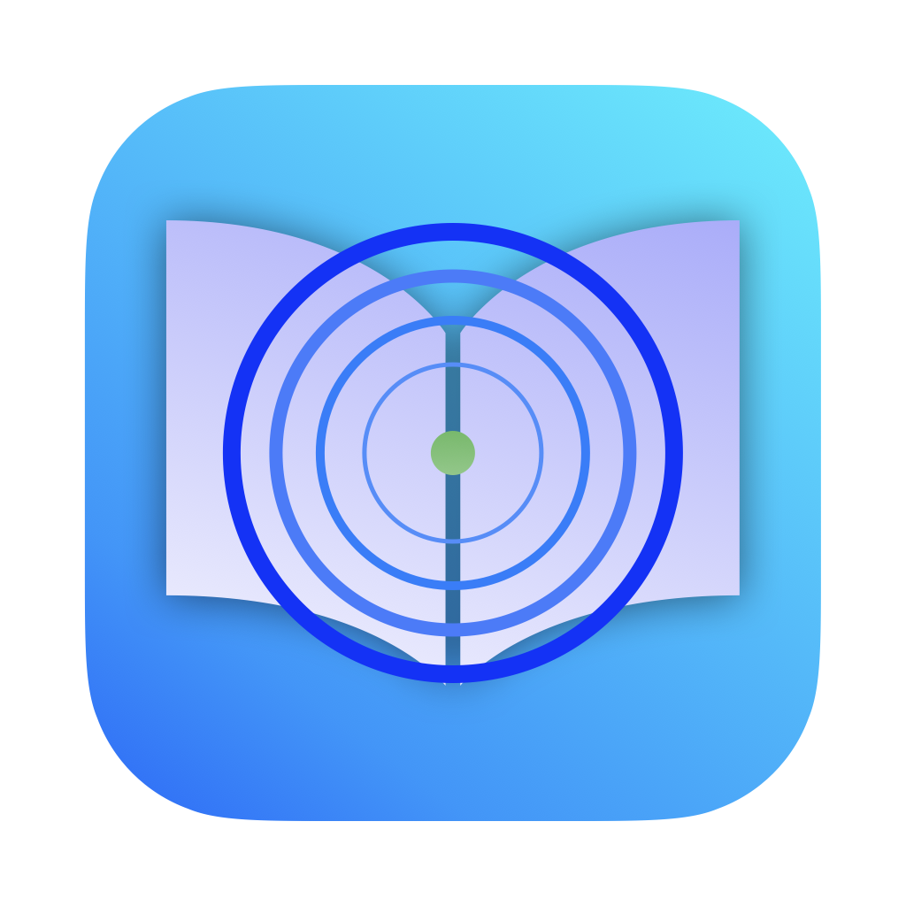
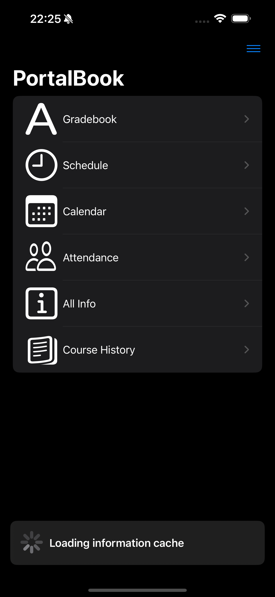
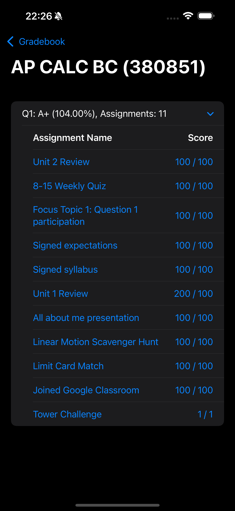
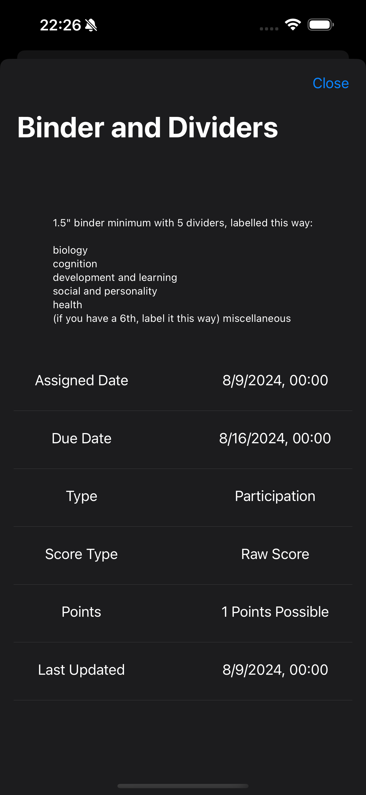

<!-- markdownlint-disable-file MD033 -->

# PortalBook

  

  <h2>
    A faster, and more efficient version of the official StudentVue app.
  </h2>

   
   

  
  
  

## Features

- Cleaner, faster, minimalist, more intuitive UI
- Cached data: gradebook, student qr code load instantly
- Faster login: <0.7s login time
- Lightweight and written completely in SwiftUI

## Libraries Used

- [AlertToast](https://github.com/elai950/AlertToast)
- [KeychainAccess](https://github.com/kishikawakatsumi/KeychainAccess)
- [MijickCalendarView](https://github.com/Mijick/CalendarView)
- [StudentVue](https://github.com/TheMoonThatRises/StudentVue.swift)
